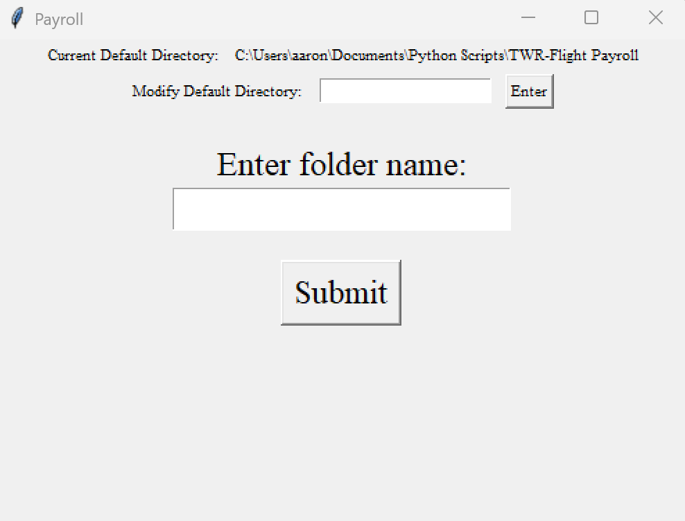

# payroll-program
A python program that calculates a redistributes tips among employees fairly.

### Background
The Wine Reserve and Flight Wine & Bourbon Bar are two businesses run by the same people whose employees rely on the money given from tips, and as such need the tips split evenly. There is a somewhat complication process that occurs to split these tips fairly, which results in a very tedious task for the owner. This program was designed to automate this difficult task, and has since saved the owner countless hours of tedious spreadsheet work.

### How it works
1. Using tkinter to build an simple interface, the user is prompted to input a folder name which should contain the necessary files for the program to compute. It also has the option to change the directory the program looks for this folder and saves it, which allows for ease of accessibility.
2. If a valid folder name is inputted, a "Run" button appears and once clicked, a progress bar loads, and eventually the resulting computations are written into a separate data sheet which can be found in the same folder the data was read.
3. This data was extracted via the use of openpyxl, where the data is then compiled into pandas multiple mathematic operations are performed to redistribute tips among each different employee depending on their number of hours worked, as well as whether or not they work in the kitchen or as a bartender.

### The Interface
 
